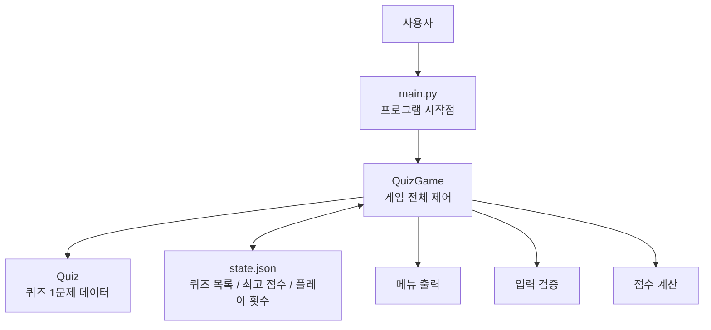

# 시스템 구조도

이 문서는 현재 프로젝트의 기본 구조를 초보자 눈높이로 설명하기 위해 작성했습니다.

## 한눈에 보는 구조

```text
사용자
  |
  v
main.py
  |
  v
QuizGame
  |--------> Quiz 객체 여러 개
  |
  |<-------> state.json
  |
  v
메뉴 출력 / 입력 처리 / 점수 계산 / 저장
```

## Mermaid 구조도



## 파일별 역할 설명

### 1. `main.py`

- 프로그램의 입구 역할을 합니다.
- `QuizGame` 객체를 만들고 `run()`을 호출하는 아주 얇은 시작 파일입니다.
- 초보자 기준으로 보면 "게임을 켜는 스위치"에 가깝습니다.

### 2. `quiz.py`

- 퀴즈 한 문제를 표현하는 `Quiz` 클래스를 담고 있습니다.
- 문제 문장, 선택지 4개, 정답 번호를 한 객체로 묶습니다.
- 화면 출력, 정답 확인, JSON 저장용 변환 기능도 함께 들어 있습니다.

### 3. `quiz_game.py`

- 실제 게임 진행을 담당하는 핵심 파일입니다.
- 메뉴를 보여 주고, 숫자 입력을 검증하고, 퀴즈를 출제하고, 점수를 계산합니다.
- `state.json`을 읽고 저장하는 역할도 이 파일이 맡습니다.

### 4. `state.json`

- 프로그램을 껐다가 다시 켜도 데이터가 유지되게 만드는 저장 파일입니다.
- 현재는 아래 정보를 저장하도록 설계했습니다.
- `quizzes`: 퀴즈 목록
- `best_score`: 최고 점수
- `play_count`: 총 플레이 횟수

## 실행 흐름 설명

1. 사용자가 `python main.py`를 실행합니다.
2. `main.py`가 `QuizGame` 객체를 만듭니다.
3. `QuizGame`은 시작할 때 `state.json`이 있는지 확인합니다.
4. 파일이 있으면 저장된 퀴즈와 점수를 불러옵니다.
5. 파일이 없거나 손상되었으면 기본 퀴즈로 복구합니다.
6. 이후 메뉴를 반복해서 보여 주며 사용자의 선택을 처리합니다.
7. 퀴즈 추가, 점수 갱신, 종료 시에는 다시 `state.json`에 저장합니다.

## 왜 이렇게 나누었는가

- `main.py`는 시작만 담당하게 해서 가장 단순하게 유지했습니다.
- `Quiz`는 "문제 1개"만 책임지게 해서 데이터 구조를 이해하기 쉽게 만들었습니다.
- `QuizGame`은 "게임 전체 흐름"만 책임지게 해서 역할이 분명하도록 했습니다.
- 저장 파일인 `state.json`을 분리해 두면 프로그램을 다시 켜도 이전 상태를 이어 갈 수 있습니다.

## 초보자용 핵심 요약

- `main.py`는 시작 버튼입니다.
- `Quiz`는 문제 1개를 담는 상자입니다.
- `QuizGame`은 전체 진행을 맡는 진행자입니다.
- `state.json`은 결과를 기억하는 노트입니다.
